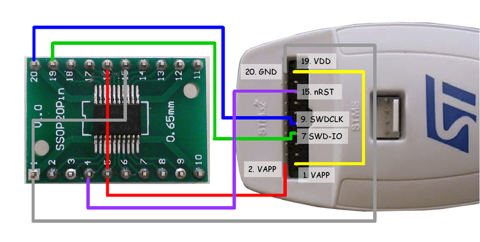
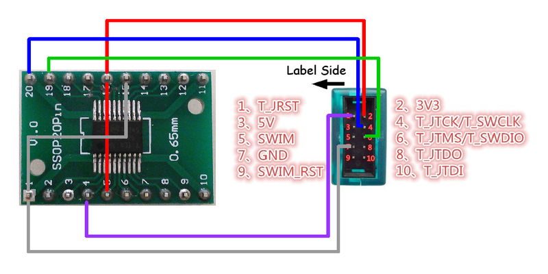

# ATS programing on [STM32F030F4P6](http://www.st.com/web/catalog/mmc/FM141/SC1169/SS1574/LN1826/PF258968)

## Hardware specification

* MCU: [STM32F030F4P6](http://www.st.com/web/catalog/mmc/FM141/SC1169/SS1574/LN1826/PF258968)
* Flash ROM: 16kB
* SRAM: 4kB

## Setup build environment

T.B.D.

## How to build

T.B.D.

## How to write firmware

Connect FSM-55 board and debugger.
See [following](#how-to-connect-fsm-55-board-and-debugger) for detail.

```
$ cd chopstx-ats/example-fsm-55-ats
$ sudo make write
```

## How to connect STM32F030F4P6 and debugger

### [STMicroelectronics - ST-LINK/V2](http://www.st.com/web/en/catalog/tools/PF251168)



### [BAITE - ST-LINK V2](http://www.aliexpress.com/item/Free-Shipping-1SET-ST-Link-st-link-V2-for-STM8S-STM8L-STM32-Cortex-M0-Cortex-M3/1619197946.html)



## License

Copyright (c) 2015 [Metasepi team](http://www.metasepi.org/).

It is distributed under GNU General Public Licence version 3 or later (GPLv3+),
Please see ["COPYING"](COPYING).
